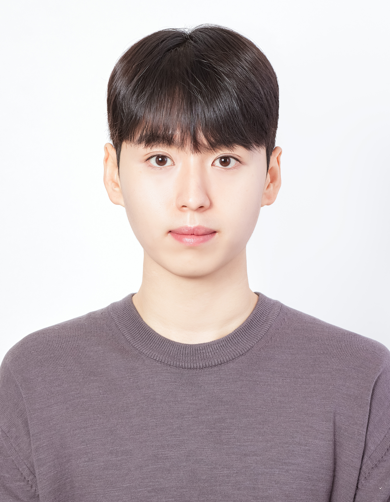

<table>
<tr>
<td width="90">
  
</td>
<td>

### **Woo SungHyun**  
Undergraduate Student @ M4ML  
Computer Engineering, Dong-A University

</td>
</tr>
</table>

## Focus
- **3D Vision**
- **3D Reconstruction**
- **Novel View Synthesis**

## Tech Stack

| Languages | Frameworks | OS | Tools |
|-----------|------------------------|----|-------|
|     |  |  |        |
